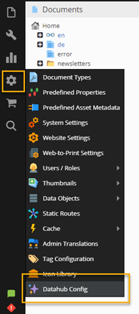
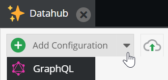

# Basic Principle

OpenDxp Datahub allows defining multiple endpoints that allow data delivery and consumption. These endpoints are configured via so called configurations that can be added in the OpenDxp admin user interface: 

## Adding a New Configuration

1. Open the Datahub configuration panel:

2. Choose an endpoint technology: 

3. Get the configuration done by defining the followings:
- General settings
- Schema configuration
- Security definitions
- Additional settings

Here you can find an example for [GraphQL](./10_GraphQL/README.md).
