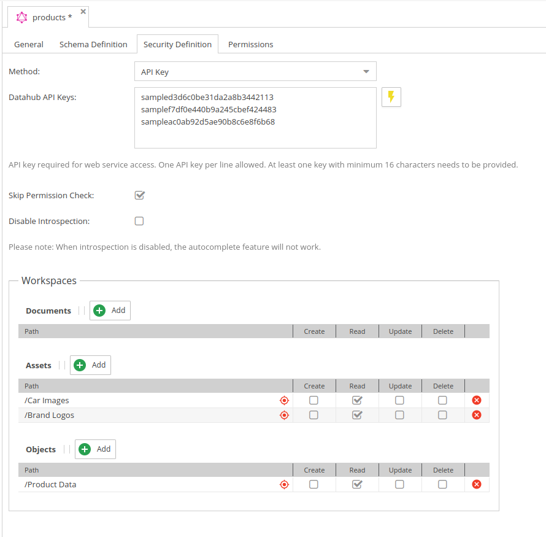

# Security Settings

The security settings define how the endpoint is secured and which data is accessible.

<div class="image-as-lightbox"></div>



## Authentication

Here you can define how users are authenticated when accessing the endpoint.

#### Supported Methods

* API Key: needs to be sent with every request.

#### API Key

To automatically create an API key use the button next to the input. 
For each click on the button a new API key is generated and will be added to the input field in addition to the list of existing keys.

## Introspection Settings

Introspection provides an information about queries which are supported by GraphQl schema. 
If introspection is enabled, the endpoint will provide a schema definition which can be used by GraphiQL or other tools to provide auto-completion and documentation.
If introspection is disabled, the schema definition will not be provided and therefore no auto-completion or documentation will be available.

This is currently enabled by default. It can be disabled via security settings tab directly in the backend or in the symfony configuration tree:
```
opendxp_data_hub:
    graphql:
        allow_introspection: false
```

## Workspace Settings

Defines workspaces for data that should be accessible via the endpoint.
The definition is similar to OpenDxp user [workspace permissions](https://docs.opendxp.io/docs/core-framework/Development_Documentation/Administration_of_Pimcore/Users_and_Roles.html) 

:::warning

If no workspace is selected, no directories are accessible.

:::

Available permissions:
* Create
* Read
* Update
* Delete


## Error Handling  - Configuration Values

The default behavior for associated/related objects, documents or assets that are not visible for the
endpoint is, to simply null it out.

You can change that via a configuration setting in symfony configuration tree:
* 1 = the entire query will fail
* 2 = null it out/skip it for multi-relations (default)
 
```
opendxp_data_hub:
    graphql:
        not_allowed_policy: 2
```

It is also possible to disable the permission checks entirely by setting the configuration option
in the security definition tab.
