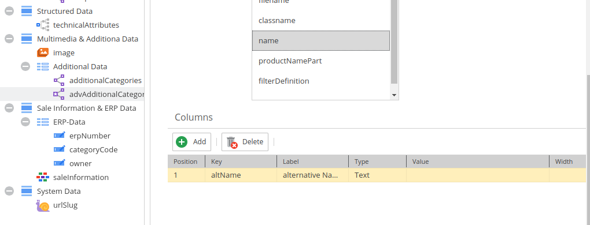
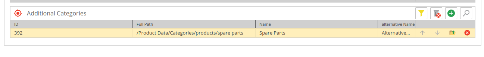

# Advanced Many-to-Many Object Relation and Metadata

Data Model for class `AccessoryPart`:

<div class="image-as-lightbox"></div>



Data:

<div class="image-as-lightbox"></div>



### Request

:::info

Note that the response differs from `Advanced Many-to-Many Relations` as there can be only class.

:::

```
{
  getAccessoryPart(id:408) {
    id,
    classname
    advAdditionalCategories {
      element {
        id, 
        classname
      }
      metadata {
        name, 
        value
      }
    }
  }
}
```

### Response

```
{
  "data": {
    "getAccessoryPart": {
      "id": "408",
      "classname": "AccessoryPart",
      "advAdditionalCategories": [
        {
          "element": {
            "id": "392",
            "classname": "Category"
          },
          "metadata": [
            {
              "name": "altName",
              "value": "AlternativeNameForCategory"
            }
          ]
        }
      ]
    }
  }
}
```


