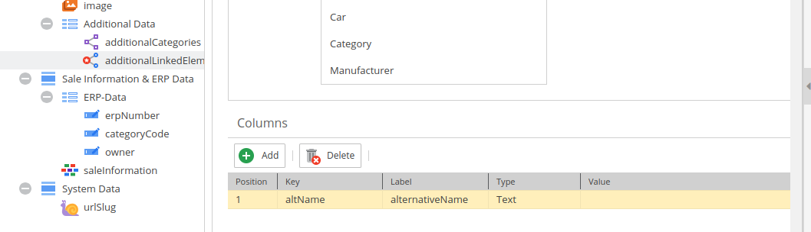
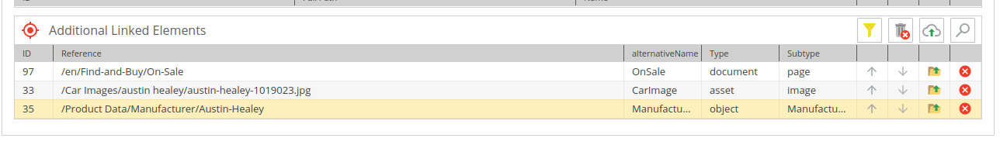

# Get Advanced Many-to-Many Relation Metadata

<div class="image-as-lightbox"></div>



Data:

<div class="image-as-lightbox"></div>



### Request

:::info

Make sure to use the correct inline fragments to access data from the related classes.
The exact class name is required to access the data. E.g. for manufacturer data use `... on object_Manufacturer`.

:::

```graphql
{
  getAccessoryPart(id:408) {
    id,
    classname
    additionalLinkedElements {
      element {
				... on asset {
          id, 
          fullpath
        }
        ... on object_Manufacturer {
          id,
          name
        }
        ... on document_page {
          id,
          fullpath
        }
      }
      metadata {
        name, 
        value
      }
    }
  }
}
```

### Response

```json
{
    "data": {
        "getAccessoryPart": {
            "id": "408",
            "classname": "AccessoryPart",
            "additionalLinkedElements": [
                {
                    "element": {
                        "id": "97",
                        "fullpath": "/en/Find-and-Buy/On-Sale"
                    },
                    "metadata": [
                        {
                            "name": "altName",
                            "value": "OnSale"
                        }
                    ]
                },
                {
                    "element": {
                        "id": "33",
                        "fullpath": "/Car%20Images/austin%20healey/austin-healey-1019023.jpg"
                    },
                    "metadata": [
                        {
                            "name": "altName",
                            "value": "CarImage"
                        }
                    ]
                },
                {
                    "element": {
                        "id": "35",
                        "name": "Austin-Healey"
                    },
                    "metadata": [
                        {
                            "name": "altName",
                            "value": "Manufacturer"
                        }
                    ]
                }
            ]
        }
    }
}
```


