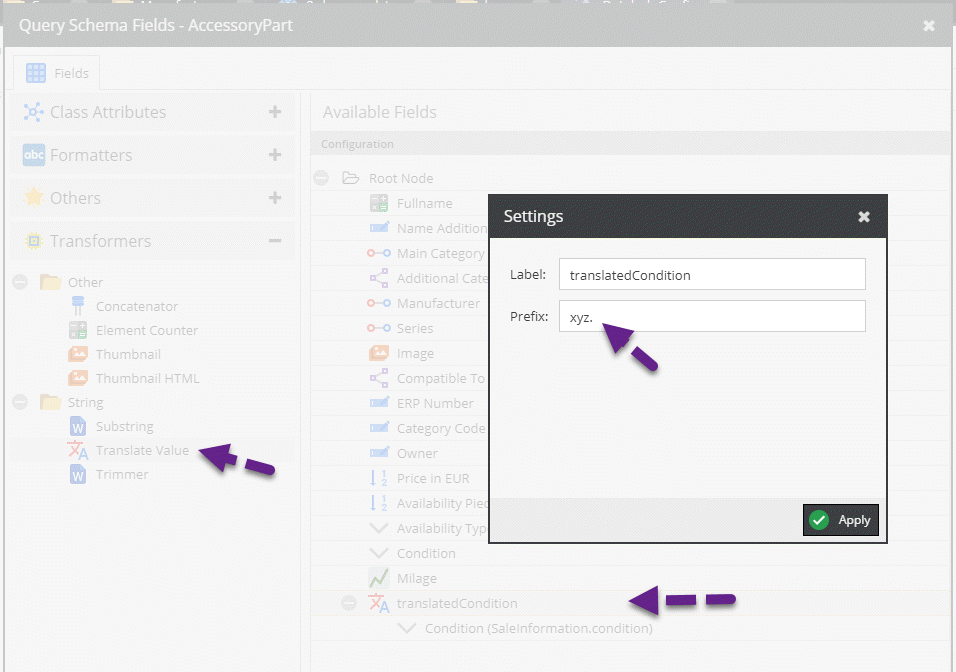

# Translate Values

The following example translates the `AccessoryPart` condition value.

Deeplink: [http://demo.opendxp.io/admin/login/deeplink?object_373_object](http://demo.opendxp.io/admin/login/deeplink?object_373_object)

Operator Config: 

<div class="image-as-lightbox"></div>



### Request

```graphql
{
  getAccessoryPart(id: 373, defaultLanguage: "de") {
    # real condition
    condition

    # processed by the website translator with the prefix as defined in the export
    # config and the language as specified above
    translatedCondition
  }
}
```

### Response

```json
{
  "data": {
    "getAccessoryPart": {
      "condition": "broken",
      "translatedCondition": "nicht mehr zu gebrauchen :-)"
    }
  }
}
```


