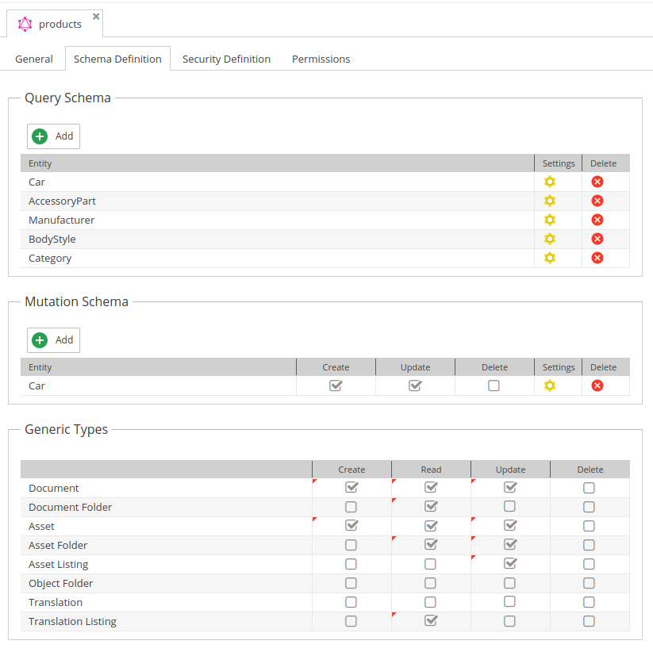

# DataObject Mutations

Data object mutations are used to create, update and delete data objects, documents, assets and translations.
Keep in mind that for all kinds of mutations you need the `Write` permission and the mutation itself needs to be enabled in the configuration.

:::info

Please be aware, that not all operations are supported for all data types.

:::

<div class="image-as-lightbox"></div>



:::info

Note that for `Create` and `Update` operate you can query the updated data using the same request.

:::

## Supported Mutation Datatypes

Also check out the OpenDxp's [data type documentation](https://docs.opendxp.io/docs/core-framework/Development_Documentation/Objects/Object_Classes/Data_Types/index.html).
For supported mutation datatypes please check the `DataObjectMutationFieldConfigGenerator` folder in `src/GraphQL/`.

## Supported Mutation Operators

See [operators section](../08_Operators/README.md) for more details.

## Create Object

Request:
```graphql
mutation {
  createNews(parentId: 429, key: "news_created_by_gql", published: false) {
    success
    message
    output(defaultLanguage: "de") {
      id      
      creationDate
      fullpath
      title(language: "en")
    }
  }
}
```

Response:
```json
{
  "data": {
    "createNews": {
      "success": true,
      "message": "object created: 1196",
      "output": {
        "id": "1196",
        "creationDate": 1732785597,
        "fullpath": "/Product Data/Accessories/lights/indicator lights/chevrolet-bel air-tail lights/news_created_by_gql",
        "title": null
      }
    }
  }
}
```

## Update Object

Updates german title and short text and returns the modification date. 

Request:
```graphql
mutation {
  updateNews(id: 1196, defaultLanguage: "de", input: {
    title: "german TITLE", 
    shortText: "new short text"
  }
  ) {
    success
    output {
      modificationDate,
      title
    }
  }
}
```

Response:
```json
{
  "data": {
    "updateNews": {
      "success": true,
      "output": {
        "modificationDate": 1732785648,
        "title": "german TITLE"
      }
    }
  }
}
```

## Delete Object

Request:
```graphql
mutation {
  deleteNews(id: 1196) {
    success
    message
  }
}
```

Response:
```graphql
{
  "data": {
    "deleteNews": {
      "success": true,
      "message": ""
    }
  }
}
```


## Extend Data Object Mutations
It is possible to add custom mutation data types and mutation operators. For details see detail documentation
pages: 
* [Add a custom mutation datatype](./25_Add_Custom_Mutation_Datatype.md)
* [Add a custom mutation operator](./26_Add_Custom_Mutation_Operator.md)


## More Examples
See following list for more examples with data object mutations:

- [Add Relations](./24_Mutation_Samples/10_Sample_Add_Relations.md)
- [Fieldcollection Mutations](./24_Mutation_Samples/15_Fieldcollection_Mutations.md)
