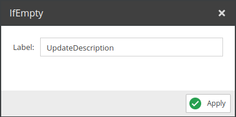
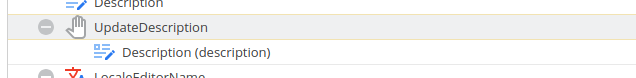

# If Empty

Only sets the value if current one is empty. Add the operator to the list and drag & drop the desired field into the operator.

## Configuration

<div class="image-as-lightbox"></div>



- **Label**: Field name to be used in the query.

## Example

<div class="image-as-lightbox"></div>



Request:
```graphql
mutation {
  updateCar(
    id:82
    input:{
      UpdateDescription:"Description if description is empty"
    }
  ) {
    success,
    output {
      description
    }
  }  
}
```

Response:
```json
{
    "data": {
        "updateCar": {
            "success": true,
            "output": {
                "description": "Description if description is empty"
            }
        }
    }
}
```
[]

