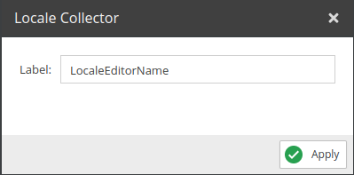
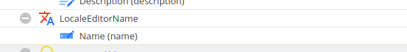

# Locale Collector

Allows editing all languages for a single field.

## Configuration

<div class="image-as-lightbox"></div>



- **Label**: Name for the field to be used in the mutation.

## Example

<div class="image-as-lightbox"></div>



Request:
```graphql
mutation {
  updateCar(
    id:82
    input:{
      LocaleEditorName: {
        en:"Name_en",
        de:"Name_de",
        fr:"Name_fr"
      }
    }
  ) {
    success,
    output {  
      name_en: name(language:"en"),
      name_de: name(language:"de"),
      name_fr: name(language:"fr")
    }
  }  
}
```

Response: 
```json
{
    "data": {
        "updateCar": {
            "success": true,
            "output": {
                "name_en": "Name_en",
                "name_de": "Name_de",
                "name_fr": "Name_fr"
            }
        }
    }
}
```