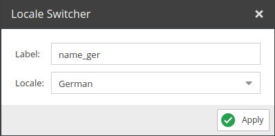
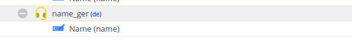

# Locale Switcher

<div class="image-as-lightbox"></div>



Switches to different language other than the default language. Add the operator to the list and 

## Configuration

<div class="image-as-lightbox"></div>



- **Label**: Field name to be used in the query.
- **Locale**: The locale you want to switch to.

## Example

Request: 
```graphql
mutation {
  updateCar(
    id:82
    input:{
     name_ger:"Wert für name Feld"
    }
  ) {
    success,
    output {  
      name_en:name(language:"en")
      name_de:name(language:"de")
    }
  }  
}
```

Response: 
```json
{
  "data": {
    "updateCar": {
      "success": true,
      "output": {
        "name_en": "Name_en",
        "name_de": "Wert für name Feld"
      }
    }
  }
}
```