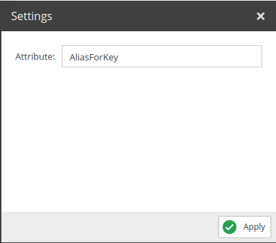
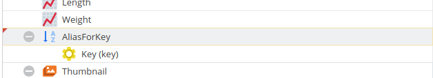

# Alias

Simply gives the child node a different name.

If you are looking for a way to directly use aliases in a GraphQL query, please see [11_Using_Aliases.md](../../04_Query/11_Using_Aliases.md) . 

## Configuration

<div class="image-as-lightbox"></div>



- **Attribute**: The new name for the field to be used in the query.

## Example

<div class="image-as-lightbox"></div>



Request:
```graphql
{
  getCar(id: 82) {
    id,
    key,
    AliasForKey
  }
}
```

Response:
```json
{
    "data": {
        "getCar": {
            "id": "81",
            "key": "Cobra 427",
            "AliasForKey": "Cobra 427"
        }
    }
}
```


