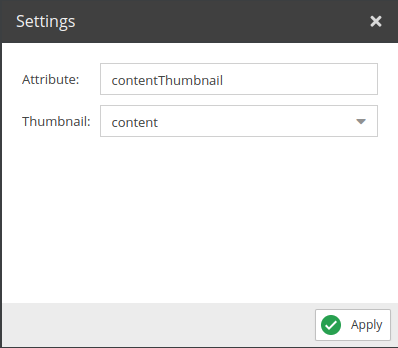
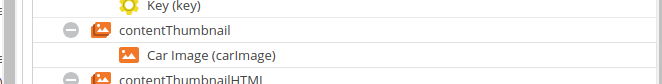

# Asset Thumbnail

Returns the selected thumbnail URL.

## Configuration

<div class="image-as-lightbox"></div>



- **Attribute**: Name for the field to use in the query.
- **Thumbnail**: Select the desired thumbnail from the list.

## Example

<div class="image-as-lightbox"></div>



Request:
```graphql
{
  getCar(id: 82) {
    id,
    contentThumbnail
  }
}
```

Response:
```json
{
    "data": {
        "getCar": {
            "id": "82",
            "contentThumbnail": "/Car%20Images/ac%20cars/68/image-thumb__68__content/automotive-car-classic-149813.44c4f656.jpg"
        }
    }
}
```

[]