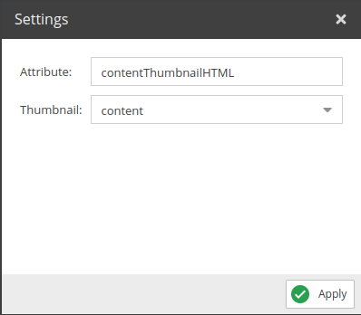

# Asset Thumbnail HTML

Returns the selected thumbnail HTML tag. 

## Configuration

<div class="image-as-lightbox"></div>



- **Attribute**: Name for the field to use in the query.
- **Thumbnail**: Select the desired thumbnail from the list.

## Example

<div class="image-as-lightbox"></div>


Request:
```graphql
{
  getCar(id: 82) {
    id,
    contentThumbnailHTML
  }
}
```

Response:
```json
{
  "data": {
    "getCar": {
      "id": "82",
      "contentThumbnailHTML": "<picture >\n\t<source srcset=\"/Car%20Images/ac%20cars/68/image-thumb__68__content/automotive-car-classic-149813.44c4f656.jpg 1x, /Car%20Images/ac%20cars/68/image-thumb__68__content/automotive-car-classic-149813@2x.44c4f656.jpg 2x\" width=\"1140\" height=\"641\" type=\"image/jpeg\" />\n\t\n</picture>\n"
    }
  }
}
```