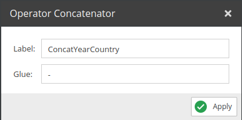

# Concatenator

Concatenates the values of the selected fields. 

## Configuration

<div class="image-as-lightbox"></div>



- **Label**: Name for the field to use in the query.
- **Glue**: The string that will be used to concatenate the values.

## Example

<div class="image-as-lightbox"></div>


Request:
```graphql
{
  getCar(id: 82) {
    id,
    ConcatYearCountry
  }
}
```

Response:
```json
{
  "data": {
    "getCar": {
      "id": "82",
      "ConcatYearCountry": "1966-GB"
    }
  }
}
```