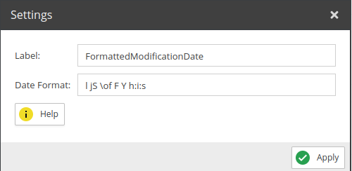
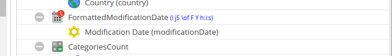

# Date Formatter

Utilizes the PHP date formatter. 

## Configuration

<div class="image-as-lightbox"></div>



- **Label**: The name for the field to be used in the query .
- **Date Format**: The format you want to use. For formatting options see [PHP Date Format](https://www.php.net/manual/en/function.date.php).

## Example

<div class="image-as-lightbox"></div>



Request:
```graphql
{
  getCar(id: 82) {
    id,
    modificationDate,
    FormattedModificationDate
  }
}
```

Response:
```json
{
    "data": {
        "getCar": {
            "id": "82",
            "modificationDate": 1732709167,
            "FormattedModificationDate": "Wednesday 27th of November 2024 12:06:07"
        }
    }
}
```