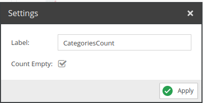
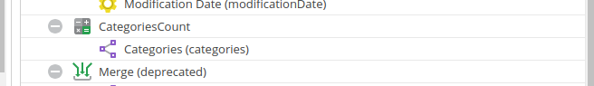

#  Element Counter

Counts the elements assigned to the selected field.
Useful for counting the number of elements in a relation field.

## Configuration

<div class="image-as-lightbox"></div>



- **Label**: Name for the field to use in the query.
- **Count Empty**: If checked, the operator will also count empty fields.

## Example

<div class="image-as-lightbox"></div>



Request:
```graphql
{
  getCar(id: 82) {
    id,
    CategoriesCount
  }
}
```

Response:
```json
{
    "data": {
        "getCar": {
            "id": "82",
            "CategoriesCount": 2
        }
    }
}
```