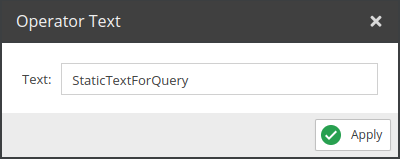

# Static Text

Adds the configured static text to the query.

## Configuration

<div class="image-as-lightbox"></div>



- **Text**: The text to add to the query.

## Example

<div class="image-as-lightbox"></div>


Request:
```graphql
{
  getCar(id: 82) {
    id,
    StaticTextForQuery
  }
}
```

Result:
```json
{
  "data": {
    "getCar": {
      "id": "81",
      "StaticTextForQuery": "StaticTextForQuery"
    }
  }
}
```