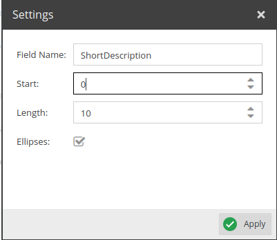
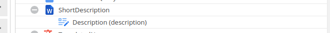

# Substring

This operator extracts a substring from a string.

## Configuration

<div class="image-as-lightbox"></div>



- **FieldName**: Name for the field to use in the query.
- **Start**: The position of the first character to extract.
- **Length**: The number of characters to extract.
- **Ellipses**: If the string is longer than the specified length, an ellipsis is added at the end.

## Example

<div class="image-as-lightbox"></div>



Request:
```graphql
{
  getCar(id: 82) {
    id,
    description,
    ShortDescription
  }
}
```

Response:
```json
{
  "data": {
    "getCar": {
      "id": "82",
      "description": "<p>Description that clearly exceeds 10 characters in length</p>",
      "ShortDescription": "<p>Descript..."
    }
  }
}
```
