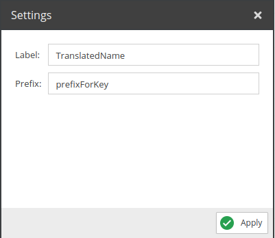
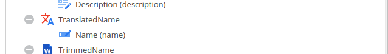

# Translate Value

Translates the values of the selected fields. For translation the default locale is used.

Similar to OpenDxp's [Translate Value](https://docs.opendxp.io/docs/core-framework/User_Documentation/DataObjects/Grid_Configuration_Operators/Operators/TranslateValue.html). For a detailed example see [Website Translations](../../04_Query/11_Query_Samples/27_Sample_Translate_Values.md).

## Configuration

<div class="image-as-lightbox"></div>



- **Label**: The label of the field.
- **Prefix**: The prefix for the translation key.

## Example

<div class="image-as-lightbox"></div>



:::info

Note: Make sure to add the translation key to the translations in the OpenDxp backend, using the admin domain.

:::

Request:
```graphql
{
  getCar(id: 82) {
    id,
    TranslatedName
  }
}
```

Response: 
```json
{
    "data": {
        "getCar": {
            "id": "82",
            "TranslatedName": "NameValuedAddedToTranslations"
        }
    }
}
```
