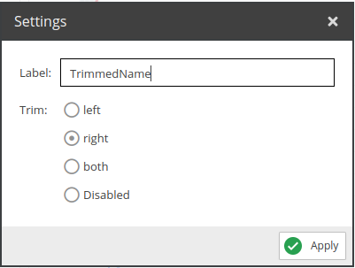
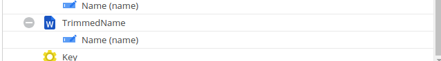

# Trimmer

Trims the value. 

## Configuration

<div class="image-as-lightbox"></div>



- **Label**: Name for the field to use in the query.
- **Trim**: Where to trim, either `both`, `left`, `right` or `disabled`.

## Example

<div class="image-as-lightbox"></div>



Request:
```graphql
{
  getCar(id: 82) {
    id,
    name,
    TrimmedName
  }
}
```

Response:
```json
{
    "data": {
        "getCar": {
            "id": "82",
            "name": " Cobra 427 ",
            "TrimmedName": " Cobra 427"
        }
    }
}
```