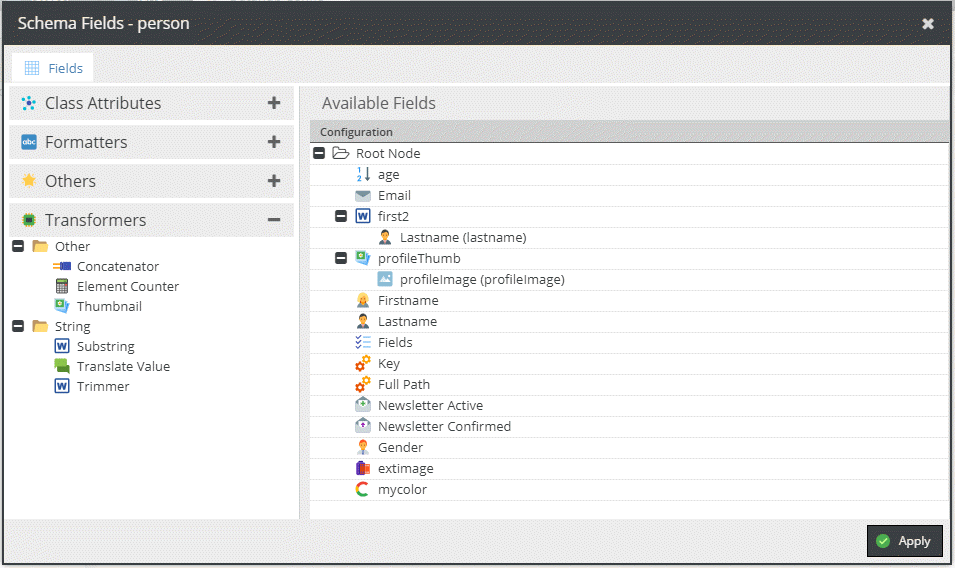

# Operators

Operators allow to modify and transform the data before it is delivered to the endpoint or stored in Pimcore,
depending on whether they are used in a query or a mutation.

Operators can be selected in the GraphQL configuration using the `Schema Definition` tab.
In the `Query Schema` section use the `gear` icon to open the configuration dialog for a data object class you want to use in queries.
In the `Mutation Schema` section use the `gear` icon to open the configuration dialog for a data object class you want to use in mutations.

This will open the `Schema Fields` configuration dialog where you can select the fields you want to use in queries or mutations.
In the tree on the left side you can select th operators you want to use by clicking on one of the 3 tabs: `Formatters`, `Others` or `Transformers`.

Add an operator by double-clicking on it or by dragging it to the right side of the dialog. 
Depending on the operator an options dialog will open where you can configure the operator.
After adding an operator you can drag & drop fields under the operator to apply the operator to them.

Please see the contents of this chapter for more information on the available operators.